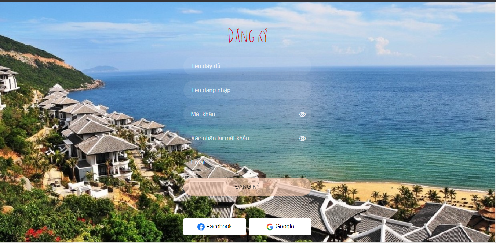
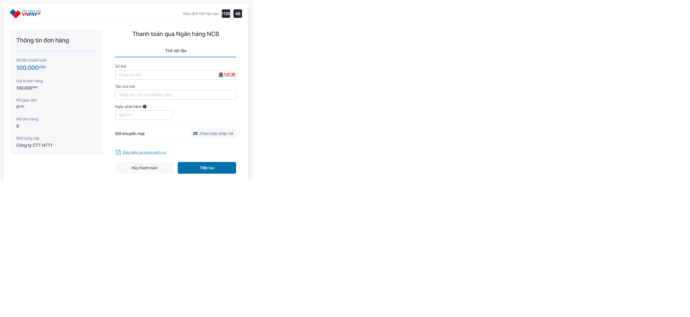
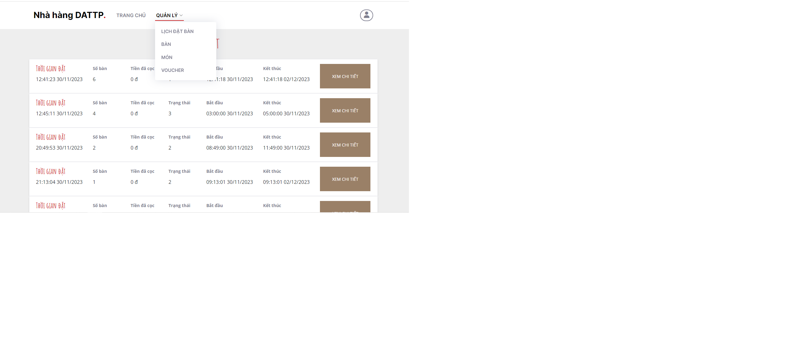

# retaurentmicroservices
# circuit breaker reactive microservice spring boot kafka
# run kafka
D:\kafka\kafka_2.13-3.6.0\bin\windows\zookeeper-server-start.bat D:\kafka\kafka_2.13-3.6.0\config\zookeeper.properties

D:\kafka\kafka_2.13-3.6.0\bin\windows\kafka-server-start.bat D:\kafka\kafka_2.13-3.6.0\config\server.properties

D:\kafka\kafka_2.13-3.6.0\bin\windows\kafka-topics.bat --create --topic product --bootstrap-server localhost:9092

D:\kafka\kafka_2.13-3.6.0\bin\windows\kafka-console-producer.bat --topic createBookingTopic --bootstrap-server localhost:9092

D:\kafka\kafka_2.13-3.6.0\bin\windows\kafka-console-consumer.bat --topic newOrder --from-beginning --bootstrap-server localhost:9092

D:\kafka\kafka_2.13-3.6.0\bin\windows\kafka-console-consumer.bat --topic checkOrder --from-beginning --bootstrap-server localhost:9092

D:\kafka\kafka_2.13-3.6.0\bin\windows\kafka-console-consumer.bat --topic notiOrder --from-beginning --bootstrap-server localhost:9092

D:\kafka\kafka_2.13-3.6.0\bin\windows\kafka-console-consumer.bat --topic createPaymentOrder --from-beginning --bootstrap-server localhost:9092

# system architecture

# feature
# ==================================== USER ========================================================
LOGIN

REGISTER

HOME

DISH

TABLE

CART

BOOKING DETAIL

PAYMENT

NOTIFICATION

# ====================================== MANAGE ======================================================
BOOKING MANAGE

TABLE MANAGE

DISH MANAGE

<!-- VOUCHER MANAGE
 -->
# 
 SOA, Microservice, DDD pattern, API base
 saga : choreography và orchestration.